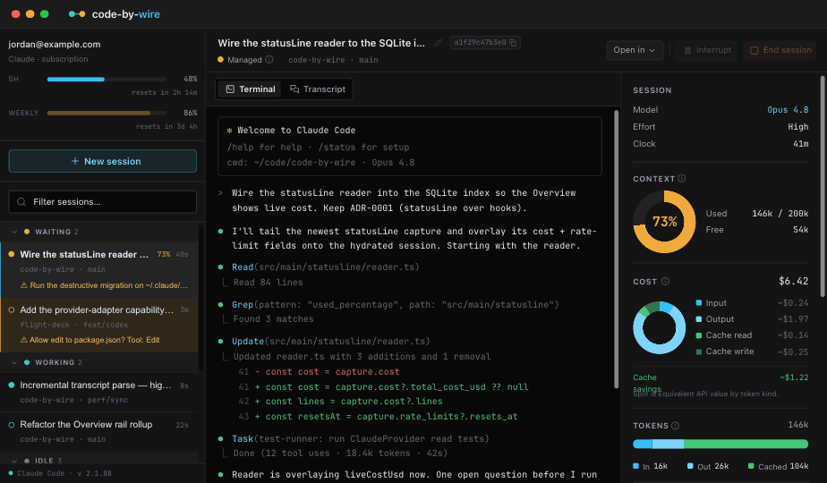

# Code-by-wire (CBW)

English | [简体中文](README.zh-CN.md)

[](https://github.com/luojiahai/code-by-wire/actions/workflows/ci.yml)
[](LICENSE)
[](https://github.com/luojiahai/code-by-wire/releases)
[](https://github.com/sponsors/luojiahai)

**The cockpit for local agentic coding tools (e.g., Claude Code).**

Code-by-wire is a desktop app that puts every agentic coding session in one place: live state,
transcript, terminal, and the cost and context telemetry the CLI keeps out of
sight. One pane instead of a dozen terminal windows.

[](https://github.com/luojiahai/code-by-wire/releases/latest)

## The name

Fly-by-wire didn't take the plane away from the pilot. It put a computer
between the stick and the control surfaces, so the pilot commands intent and the
machine handles execution. The pilot still flies, just more capable and more
precise.

Code-by-wire is that idea for software. You command intent, the agent executes,
and you stay pilot in command: live state, the full transcript, and the controls
to take over whenever you want.

## Preview



## Features

Code-by-wire reads everything Claude Code writes under `~/.claude` and turns it
into one live dashboard. Nothing to set up: open the app and every session
already running on your machine is there.

### See every session at a glance

**One rail, every session.** The left rail lists every Claude Code session on
your machine, one row each. A filter box narrows the list as you type.

**Grouped by what needs you.** Rows are grouped by state in priority order:
**Waiting → Working → Idle → Ended**, each group with a sticky header and a live
count. Ended is collapsed by default. It's the archive, not the live work.

### Drive or watch any session

**Spawn a managed session.** Pick a directory and a model, and Code-by-wire
starts `claude` there and drives it from a live terminal embedded in the
workspace.

**Observe the rest.** A session you started anywhere else shows up read-only:
full state and transcript, but no input, because two processes writing one
transcript would corrupt it.

**Adopt when it ends.** Once an observed session ends, adopt it to resume it
inside the app and take the controls. The button appears only once the original
process is gone, which is the only time it's safe.

**Terminal or transcript.** A managed session toggles between its live terminal
and the rendered transcript. Switching away only detaches the view. The terminal
keeps buffering, so you never lose scrollback.

### Read exactly what the agent did

**The full transcript.** Every message, tool call, and tool result,
reconstructed from the raw transcript on disk and rendered cleanly, step by step.

**Turn timeline.** Below the live view, a turn-by-turn strip: each prompt you
sent, how many tools it triggered, how long the turn ran, and how long ago it
started.

### The telemetry Claude Code keeps out of sight

A right-hand rail of live panels:

- **Context.** How full the window is, as a ring toward the ceiling, using
  Claude's own number when it reports one. The session rail also flags any
  session whose context is running high.
- **Cost.** The session's spend, with a donut of where it went by token kind and
  how much the prompt cache saved. On a subscription account this is _equivalent
  API value_: what the tokens would cost at API rates. A reference figure, never
  money owed.
- **Tokens.** Input, output, and cached totals as a stacked bar.
- **Token speed.** Live throughput, output and input rates over a rolling window.
- **Git.** Branch, lines added and removed, ahead/behind, current SHA, and
  working-tree status. Hidden when the directory isn't a repo.
- **Tasks.** The session's task list with each item's status and what it's
  blocked by.
- **Subagents.** The tree of child sessions a session spawned, nested by depth.
- **Session.** Model, effort level, and the run clock.

### Know your account

The rail header reads your account straight from `~/.claude`. On a subscription
(Pro or Max) it shows your plan and rate-limit gauges with live reset
countdowns, so you can see how close you are to a wall. On an API account it
shows the endpoint host and plan. The app works out which from whether your
sessions report rate limits, and shows cost the right way for each.

## Install

Download the prebuilt app, or build it yourself.

### Download

1. [Download the latest `.dmg`](https://github.com/luojiahai/code-by-wire/releases/latest).
2. Open it and drag code-by-wire to Applications.
3. Launch it. The app is signed and notarized by Apple, so it opens straight
   away, no Gatekeeper warning and no quarantine workaround.

### Build from source

Build an unsigned `.dmg` locally instead:

```
pnpm install
pnpm rebuild:native   # rebuild better-sqlite3 + node-pty for Electron's ABI
pnpm dist             # writes the .dmg to release/
```

Open the `.dmg` from `release/` and drag code-by-wire to Applications. Because
it's unsigned, the first launch may need a right-click → **Open**, or clearing
the quarantine flag:

```
xattr -dr com.apple.quarantine /Applications/code-by-wire.app
```

## Requirements

- macOS (Apple Silicon)
- [Claude Code](https://docs.anthropic.com/en/docs/claude-code) installed
  locally, so there are sessions to observe and control

## Develop

```
pnpm install
pnpm rebuild:native   # rebuild better-sqlite3 + node-pty for Electron's ABI
pnpm dev              # launch the app
```

`pnpm test` runs the provider read tests over the redacted `~/.claude` fixtures
in `tests/fixtures/`. `pnpm typecheck` checks the main and renderer projects.

See [CONTRIBUTING.md](CONTRIBUTING.md) to get started.

## Project layout

```
src/
  main/       Electron main process: providers, db, git, terminal, sync
  preload/    the IPC bridge
  renderer/   React UI (session list, workspace panels, terminal)
  shared/     types and helpers shared across processes
```

## License

[MIT](LICENSE)
