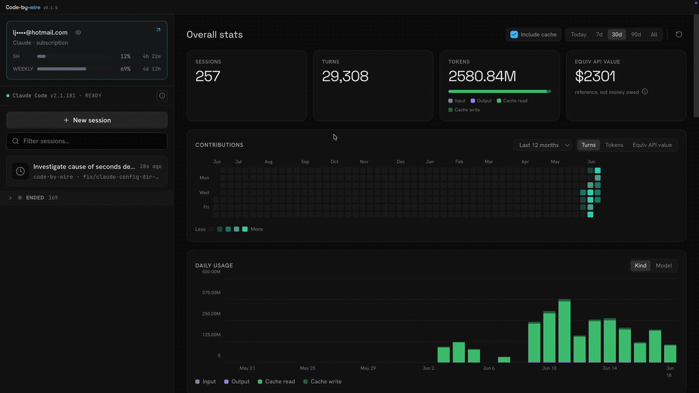

# Code-by-wire (CBW)

English | [简体中文](README.zh-CN.md)

[](https://github.com/luojiahai/code-by-wire/actions/workflows/ci.yml)
[](LICENSE)
[](https://github.com/luojiahai/code-by-wire/releases)
[](https://github.com/sponsors/luojiahai)

**The cockpit for local Claude Code.**

Claude Code writes a rich trail to the `.claude` directory as it works: every
turn, every token, every tool call, the running cost, the context window. The
CLI shows you almost none of it.

Code-by-wire reads that trail and turns it into one live dashboard. Every
session on your machine in one place, with live state, the full transcript, an
embedded terminal to drive or take over, and the telemetry the terminal hides.
One pane instead of a dozen terminal windows.



**[Download for macOS (Apple Silicon)](https://github.com/luojiahai/code-by-wire/releases/latest)**\
**[Download for Windows (x64)](https://github.com/luojiahai/code-by-wire/releases/latest)**

## What you get

- **Every session in one rail.** Active sessions in one live list, each card
  flagging its own state; ended ones fold into a zone below.
- **Drive, fork, or just watch.** Spawn a managed session in an embedded
  terminal, fork or adopt any other, or observe one read-only.
- **The full transcript.** Every message, tool call, and result, reconstructed
  from disk and rendered cleanly.
- **The telemetry the CLI hides.** Live cost, context window, token throughput,
  git, tasks, subagents, and background shells, per session.
- **The whole story.** A cross-session overview with a year-long contributions
  calendar and exact, never-estimated totals.
- **Knows your account.** Reads your plan and rate-limit gauges straight from
  the `.claude` directory.

## Features

Nothing to set up. Open the app and every session already running on your
machine is there.

### 👀 See every session at a glance

**Active up top, ended folded away.** Everything still running sits in one live
list, newest first, each card carrying a small state icon for working, waiting,
or idle. A filter box narrows it as you type. Ended sessions collapse into their
own zone below, the archive, not the live work.

### 🕹️ Start, drive, or watch any session

**Start one in a click.** New session picks a directory and a model, then spawns
Claude Code in an embedded terminal. Fork any session to branch a fresh copy from
where it left off, or end a running one right from its header.

**Observe safely, adopt later.** A session you started elsewhere shows up
read-only, because two processes writing one transcript would corrupt it. Once
it ends, adopt it to resume inside the app and take the controls. The adopt
button appears only when the original process is gone, the only time it's safe.

**Terminal or transcript.** A managed session toggles between its live terminal
and the rendered transcript. Switching away only detaches the view. The terminal
keeps buffering, so you never lose scrollback.

**Label it, open it.** Rename any session inline to whatever you'll recognize it
by. Open its working directory straight in your editor or file browser.

### 📜 Read exactly what the agent did

**The full transcript, step by step.** Every message, tool call, and tool
result, reconstructed from the raw transcript on disk and rendered cleanly.

**A dock that follows the work.** Below the live view, a dock tabs through the
session's structure and snaps to whatever's happening:

- **Tasks.** The task list with each item's status and what it's blocked by.
- **Subagents.** The child sessions a session spawned, as a live timeline you
  can drill into.
- **Shells.** Background shells the session kicked off, reconstructed from the
  transcript, with their full output on demand.
- **Turns.** A turn-by-turn strip: each prompt you sent, how many tools it
  triggered, how long it ran, and how long ago.

### 📊 The telemetry Claude Code keeps out of sight

A right-hand rail of live panels:

- **Context.** How full the window is, as a ring toward the ceiling, using
  Claude's own number when it reports one. The session rail also flags any
  session whose context is running high.
- **Cost.** The session's spend, with a donut of where it went by token kind and
  how much the prompt cache saved. On a subscription account this is _equivalent
  API value_: what the tokens would cost at API rates. A reference figure, never
  money owed.
- **Tokens.** Input, output, and cached totals as a stacked bar.
- **Token speed.** Live throughput, output and input rates over a rolling window.
- **Git.** Branch, lines added and removed, ahead/behind, current SHA, and
  working-tree status. Hidden when the directory isn't a repo.
- **Session.** Model, effort level, and the run clock.

### 📈 The whole story across every session

**Overview is where the app opens.** Reached from the account card pinned to the
top of the rail, it's an app-level view that totals every Claude Code session on
your machine, not just the one you're watching. Pick a range: Today, 7d, 30d,
90d, or All.

**Headline numbers.** Sessions, turns, tokens, and equivalent API value for the
range, with a stacked bar of where the tokens went.

**A contributions calendar.** A year of activity as a heatmap, colored by turns,
tokens, or equivalent API value. Click any day to scope the whole page to it.

**Daily usage.** One stacked bar per day, split by token kind or by model.

**Three ways to slice it.** By model, by project with each project's branches
folded in, and by session in a sortable table. An _Include cache_ toggle decides
whether cached tokens count toward the totals.

**Exact, never estimated.** Every number is read straight from the transcripts
on disk, deduped and totalled. No sampling, no guesses. The first launch
backfills your history behind a progress bar, then it stays live like everything
else.

### 💳 Know your account

The rail's top card reads your account straight from the `.claude` directory. On
a subscription (Pro or Max) it shows your plan and rate-limit gauges with live
reset countdowns, so you can see how close you are to a wall. On an API account
it shows the endpoint host and plan. The account email is masked by default, one
click to reveal, so you can screen-share without leaking it. The same card opens
Overview.

### ⚙️ Settings and CLI health

A gear in the title bar opens Settings. **System** checks your local Claude Code,
whether it's found, current, and logged in, and hands you the exact fix when
something's off, plus a field to point the app at a non-standard binary.
**Account** expands your plan and limits; **Appearance** and **About** round it
out. The gear wears a caution badge that lights amber or red the moment the CLI
needs attention, so a broken or logged-out install never slips by.

## Install

Download the prebuilt app, or build it yourself.

### Download

1. [Download the latest `.dmg`](https://github.com/luojiahai/code-by-wire/releases/latest).
2. Open it and drag Code-by-wire to Applications.
3. Launch it. The app is signed and notarized by Apple, so it opens straight
   away, no Gatekeeper warning and no quarantine workaround.

On Windows, download the `.exe` and run it. It's unsigned for now, so Windows
SmartScreen may warn — click **More info → Run anyway**. Build from source with
`pnpm dist:win` (see CONTRIBUTING).

### Build from source

Build an unsigned app locally instead. Run the command for your platform:

```
pnpm install
pnpm rebuild:native   # rebuild better-sqlite3 + node-pty for Electron's ABI
pnpm dist             # macOS: writes the .dmg to release/
pnpm dist:win         # Windows: writes the .exe to release/
```

On macOS, open the `.dmg` from `release/` and drag Code-by-wire to Applications.
Because it's unsigned, the first launch may need a right-click → **Open**, or
clearing the quarantine flag:

```
xattr -dr com.apple.quarantine /Applications/Code-by-wire.app
```

On Windows, run the `.exe` from `release/`. It's unsigned, so SmartScreen may
warn — click **More info → Run anyway**.

## Requirements

- macOS (Apple Silicon) or Windows (x64)
- [Claude Code](https://docs.anthropic.com/en/docs/claude-code) installed
  locally, so there are sessions to observe and control

## Develop

```
pnpm install
pnpm rebuild:native   # rebuild better-sqlite3 + node-pty for Electron's ABI
pnpm dev              # launch the app
```

`pnpm test` runs the provider read tests over the redacted `.claude` fixtures
in `tests/fixtures/`. `pnpm typecheck` checks the main and renderer projects.

This is a personal project and isn't taking outside code, but bug reports and
ideas are welcome. [Open an issue](https://github.com/luojiahai/code-by-wire/issues/new/choose),
or see [CONTRIBUTING.md](CONTRIBUTING.md).

## License

[MIT](LICENSE)
