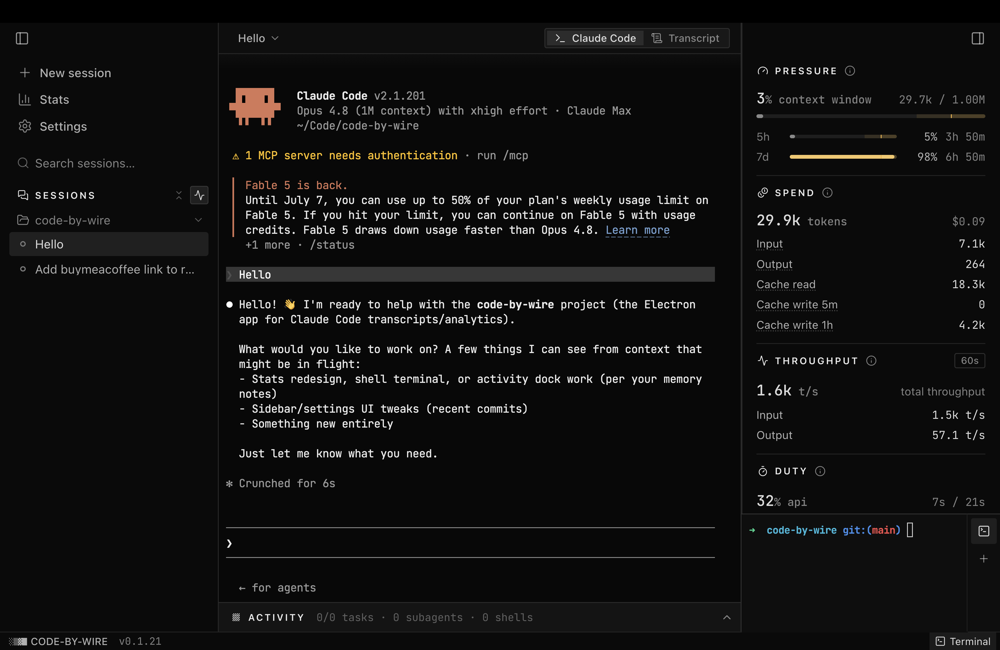

#  Code-by-wire

[English](README.md) | 简体中文

[](https://github.com/luojiahai/code-by-wire/actions/workflows/ci.yml)
[](LICENSE)
[](https://github.com/luojiahai/code-by-wire/releases)
[](https://github.com/sponsors/luojiahai)

[](https://buymeacoffee.com/luojiahai)

**本地 Claude Code 的驾驶舱。**

Claude Code 一边工作，一边把丰富的轨迹写进 `.claude` 目录：每一个回合、每一个 token、每一次工具
调用、实时花费、上下文窗口。可 CLI 几乎什么都不给你看。

Code-by-wire 读取这份轨迹，把它变成一块实时仪表盘。你机器上的每个会话都集中到一处：实时状态、
完整记录、一个可驱动或随时接管的内嵌终端，以及终端从不展示给你的遥测。一块面板，取代十几个终端
窗口。



## 下载

点一下即开始下载，始终是最新版本。

| 平台                  | 文件                                                                                                                              |
| --------------------- | --------------------------------------------------------------------------------------------------------------------------------- |
| macOS · Apple Silicon | [`Code-by-wire-arm64.dmg`](https://github.com/luojiahai/code-by-wire/releases/latest/download/Code-by-wire-arm64.dmg)             |
| macOS · Intel         | [`Code-by-wire-x64.dmg`](https://github.com/luojiahai/code-by-wire/releases/latest/download/Code-by-wire-x64.dmg)                 |
| Windows · x64         | [`Code-by-wire-Setup-x64.exe`](https://github.com/luojiahai/code-by-wire/releases/latest/download/Code-by-wire-Setup-x64.exe)     |
| Windows · ARM64       | [`Code-by-wire-Setup-arm64.exe`](https://github.com/luojiahai/code-by-wire/releases/latest/download/Code-by-wire-Setup-arm64.exe) |

## 你能得到什么

- **所有会话，一条侧栏。** 一条可搜索的侧栏，把每个会话按项目分进可折叠的文件夹，每一行各自标出自己的实时状态。
- **驱动、fork，或只是旁观。** 在内嵌终端里启动一个 managed 会话，fork 一个正在跑的会话，接管一个你在别处启动的会话，或只读旁观它。
- **完整的会话记录。** 每条消息、每次工具调用与结果，从磁盘重建并清晰渲染。
- **CLI 藏起来的遥测。** 实时上下文压力、花费、token 吞吐、占空比、git、任务、子 agent 与后台 shell，逐会话呈现。
- **纵观全貌。** 一个跨会话的 Stats 视图，配一整年的贡献日历，以及精确、绝不估算的总量。
- **限额尽收眼底。** 直接从 `.claude` 目录读出你账户的限流窗口，附实时重置倒计时。

## 功能

无需任何配置。打开应用，你机器上正在跑的每个会话就都在这里。

### 👀 一眼看尽所有会话

**按项目分组，随手折叠。** 侧栏把每个会话装进按项目划分的可折叠文件夹，最近活跃的在前，每个
文件夹带一个实时计数，顶部再给一个总数。文件夹内部，活跃会话排在结束会话之上，每一行都带一个
小小的状态圆点——working、waiting、idle 或 ended。

**随输入即时搜索。** 侧栏顶部的搜索框在你一开始输入时，就按会话名或项目筛过整份列表。

### 🕹️ 启动、驱动或旁观任意会话

**一键开一个。** 新会话先选一个目录和一个模型，再在内嵌终端里启动 Claude Code。fork 一个正在
跑的会话，从它停下的地方分出一份新的副本；或者从会话头部的菜单里结束一个正在跑的会话。

**安全旁观，结束后接管。** 你在别处启动的会话以只读形式出现，因为两个进程写同一份会话记录会
把它写坏。它结束后，接管它即可在应用内恢复并拿到操控权。接管只在原进程退出后才解锁，而那正是
唯一安全的时机。

**终端或会话记录。** 一个 managed 会话可以在实时终端和渲染后的会话记录之间切换。切走只是把
视图分离，终端仍在持续缓冲，所以你永远不会丢失滚动历史。

**随手命名，随手打开。** 给任意会话就地改名，取个你一眼能认出的名字，复制它的 id，或把它的
工作目录在 VS Code 或你的文件浏览器里打开。

### 📜 看清 agent 究竟做了什么

**完整的会话记录，一步一步。** 每条消息、每次工具调用与工具结果，都从磁盘上的原始记录重建并
清晰渲染。

**一个跟着活儿走的停靠栏。** 在实时视图下方，Structure 停靠栏用标签页切换会话的构成，并随时
跳到正在发生的事；无事发生时它收成一行小结：

- **任务。** 任务列表，附每一项的状态以及它被什么阻塞。
- **子 agent。** 会话派生出的子会话，列成一份可下钻的实时列表。
- **Shell。** 会话起的后台 shell，从会话记录重建，需要时可看完整输出。

### 📊 Claude Code 藏起来的遥测

选中一个会话，右侧一栏实时面板就把它读出来：

- **压力（Pressure）。** 上下文窗口填了多满——有 Claude 自己报的数字时就用它——之上叠着你
  账户的限流窗口：5 小时、7 天，以及存在时的按模型周度桶，每个都是一根带已用百分比和实时
  重置倒计时的进度条。条子填得越满，越会转成琥珀色乃至触顶转红。
- **花费（Spend）。** token 总量，旁边配 Claude Code 自己算的美元数字，并按类别拆开：新鲜
  输入、生成输出、缓存读取，以及 5 分钟和 1 小时的缓存写入。订阅账户下，这个美元数字是
  _等价 API 价值_——这些 token 按 API 价格会花多少钱，绝不是欠款。
- **吞吐（Throughput）。** 按滚动窗口算出的实时 token 速率，输出与输入。
- **占空比（Duty）。** 会话的占空比——在整段挂钟时间里，API 真正在干活的比例。
- **会话（Session）。** 模型、思考力度和运行时钟，外加 git（分支、脏状态、领先/落后）、关联的
  pull request、增删行数，以及距上次活动的时间。

### 📈 纵观每一个会话的全貌

**应用打开就是 Stats。** 从侧栏顶部的菜单进入，它汇总你机器上的每个 Claude Code 会话，而不只是
你正在看的那一个。选一个区间：Today、7d、30d、90d 或 All。

**头条数字。** 一格网格，摆出一眼值得知道的数字——会话数、token 数、你最常用的模型、活跃天数、
最活跃的一天、最长的一次会话，以及你最长和当前的连续活跃天数。

**贡献日历。** 把一整年的活跃度画成 token 热力图。窗口可在最近十二个月和任意往年之间切换，点
任意一天即可把整页收窄到那一天。

**每日 token。** 每天一根堆叠条，按模型拆分，旁边再配一份区间内的按模型明细。

**另外两种切法。** 按项目（每个项目的活儿折叠在一起），以及在一张可排序的表里按会话。一个
_Include cache_ 开关决定缓存 token 是否计入总量。

**精确，绝不估算。** 每个数字都直接从磁盘上的会话记录读出，去重后汇总。不抽样，不猜测。首次
启动会在进度条后回填你的历史，之后便像其余部分一样保持实时——你也可以随时重置并从头重建它。

### ⚙️ 设置与 CLI 健康

**设置**从侧栏顶部的菜单打开，分两个部分。**System** 检查你本地的 Claude Code——是否找得到、
是否够新、是否已登录——有问题时给你递上确切的修法，还带一个字段把应用指向非标准路径的二进制；
它还会标出重复安装或配置目录不一致。System 标签上挂着一枚警示徽标，CLI 一需要留意就亮起琥珀或
红色，让坏掉或退登的安装绝不会被忽略。**About** 承载应用版本，并负责软件更新。

## 安装

从上方的 [下载](#下载) 取得安装包，或者自己构建。

### 首次启动

macOS 上打开 `.dmg`，把 Code-by-wire 拖进「应用程序」，然后启动它。应用已由 Apple 签名并公证，可以直接打开，没有 Gatekeeper 警告，也不需要绕过隔离标记。

Windows 上运行 `.exe`。目前未签名，SmartScreen 可能会警告——点 **更多信息 → 仍要运行**。

### 从源码构建

也可以在本地构建一个未签名的应用。按你的平台运行对应命令：

```
pnpm install
pnpm rebuild:native   # 为 Electron 的 ABI 重新编译 better-sqlite3 + node-pty
pnpm dist             # macOS：把 .dmg 输出到 release/
pnpm dist:win         # Windows：把 .exe 输出到 release/
```

macOS 上从 `release/` 打开 `.dmg`，把 Code-by-wire 拖进「应用程序」。由于它未签名，首次启动可能需要
右键 → **打开**，或清除隔离标记：

```
xattr -dr com.apple.quarantine /Applications/Code-by-wire.app
```

Windows 上从 `release/` 运行 `.exe`。它未签名，SmartScreen 可能会警告——点 **更多信息 → 仍要运行**。

## 环境要求

- macOS（Apple Silicon 或 Intel）或 Windows（x64 或 ARM64）
- 本地安装了 [Claude Code](https://docs.anthropic.com/en/docs/claude-code)，这样才有会话
  可供观察和控制

## 开发

```
pnpm install
pnpm rebuild:native   # 为 Electron 的 ABI 重新编译 better-sqlite3 + node-pty
pnpm dev              # 启动应用
```

`pnpm test` 会针对 `tests/fixtures/` 中脱敏后的 `.claude` fixture 运行 provider 读取测试。
`pnpm typecheck` 检查主进程和渲染进程两个项目。

这是个人项目，不接受外部代码贡献，但欢迎反馈问题和想法。[提交 issue](https://github.com/luojiahai/code-by-wire/issues/new/choose)，或查看 [CONTRIBUTING.md](CONTRIBUTING.md)。

## 许可证

[MIT](LICENSE)
