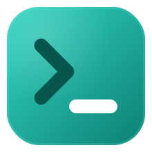
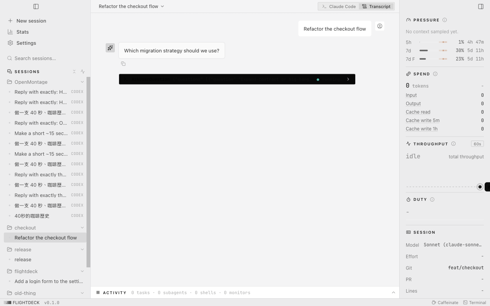

#  FlightDeck

[English](README.md) | [简体中文](README.zh-CN.md) | 繁體中文 | [日本語](README.ja.md) | [한국어](README.ko.md) | [Español](README.es.md) | [Français](README.fr.md)

[](https://github.com/wilsonwang0713/code-by-wilson/actions/workflows/ci.yml)
[](LICENSE)
[](https://github.com/wilsonwang0713/code-by-wilson/releases)

**駕馭每一個 Claude Code 工作階段，檢視其豐富的對話記錄，監控遙測數據，全在一個介面裡。**



## 功能

需要本機已安裝 Claude Code。打開應用程式，機器上正在執行的每一個工作階段都在這裡。

- **所有工作階段集中於一個側欄。** 從一個側欄管理機器上執行的每一個工作階段：依專案分組、可搜尋，各自標示即時狀態。
- **駕駛、分叉，或只是旁觀。** 在內嵌終端機裡啟動工作階段、分叉一個執行中的工作階段、接管在別處啟動的工作階段，或以唯讀方式觀察。
- **完整的對話記錄。** 每一則訊息、工具呼叫與結果，從磁碟重建並清晰呈現。
- **CLI 藏起來的遙測。** 上下文壓力、花費、即時吞吐、佔空比、git、任務、子代理與背景 shell，逐工作階段呈現。
- **完整的全貌。** 跨工作階段的統計檢視——依模型堆疊的每日圖表、模型佔比環圖、帶一週預測的累計用量、依星期 × 小時的活躍熱力圖，以及一整年的貢獻月曆——全部精確，絕不估算。
- **速率限制一目了然。** 你帳戶的速率限制視窗與各模型的每週額度，直接從磁碟讀取，以弧形儀表呈現並帶即時重置倒數。
- **淺色或深色。** 深色之外還有完整的淺色主題，也可跟隨系統——在「設定 → 外觀」中設定。
- **靈動島（macOS）。** 瀏海下方的可選浮層：一顆藥丸一瞥即知狀態，展開後是等你處理的工作階段收件匣——點一下即可跳轉過去。

## 下載

| 平台                  | 檔案                                                                                                                                 |
| --------------------- | ------------------------------------------------------------------------------------------------------------------------------------ |
| macOS · Apple Silicon | [`FlightDeck-arm64.dmg`](https://github.com/wilsonwang0713/code-by-wilson/releases/latest/download/FlightDeck-arm64.dmg)             |
| macOS · Intel         | [`FlightDeck-x64.dmg`](https://github.com/wilsonwang0713/code-by-wilson/releases/latest/download/FlightDeck-x64.dmg)                 |
| Windows · x64         | [`FlightDeck-Setup-x64.exe`](https://github.com/wilsonwang0713/code-by-wilson/releases/latest/download/FlightDeck-Setup-x64.exe)     |
| Windows · ARM64       | [`FlightDeck-Setup-arm64.exe`](https://github.com/wilsonwang0713/code-by-wilson/releases/latest/download/FlightDeck-Setup-arm64.exe) |

點一下即可開始下載，永遠是最新版本。你需要本機已安裝
[Claude Code](https://docs.anthropic.com/en/docs/claude-code)，才有可觀察與控制的工作階段。

在 macOS 上，打開 `.dmg` 並將 FlightDeck 拖到「應用程式」。在 Windows 上執行
`.exe`；若 SmartScreen 警告，點擊 **其他資訊 → 仍要執行**。

安裝後，應用程式會在啟動時檢查新版本，並可從「設定 → 關於」更新。

## 從原始碼建置

```
pnpm install
pnpm rebuild:native   # 針對 Electron 的 ABI 重建 better-sqlite3 + node-pty
pnpm dist             # macOS：將 .dmg 寫入 release/
pnpm dist:win         # Windows：將 .exe 寫入 release/
```

本機建置的應用程式未簽章：在 macOS 上首次啟動可能需要右鍵 → **打開**，或用
`xattr -dr com.apple.quarantine /Applications/FlightDeck.app` 清除隔離旗標；在
Windows 上 SmartScreen 可能警告：點擊 **其他資訊 → 仍要執行**。

## 開發

```
pnpm install
pnpm rebuild:native   # 針對 Electron 的 ABI 重建 better-sqlite3 + node-pty
pnpm dev              # 啟動應用程式
```

`pnpm test` 在 `tests/fixtures/` 中去識別化的 `.claude` fixture 上執行 provider 讀取測試。
`pnpm typecheck` 檢查 main 與 renderer 專案。

歡迎提交 bug 回報與想法。[提交 issue](https://github.com/wilsonwang0713/code-by-wilson/issues/new/choose)，
或參見 [CONTRIBUTING.md](CONTRIBUTING.md)。

## 授權

[MIT](LICENSE) © Yihhsuan Wang。第三方與上游聲明保留於
[THIRD_PARTY_NOTICES.md](THIRD_PARTY_NOTICES.md)。
